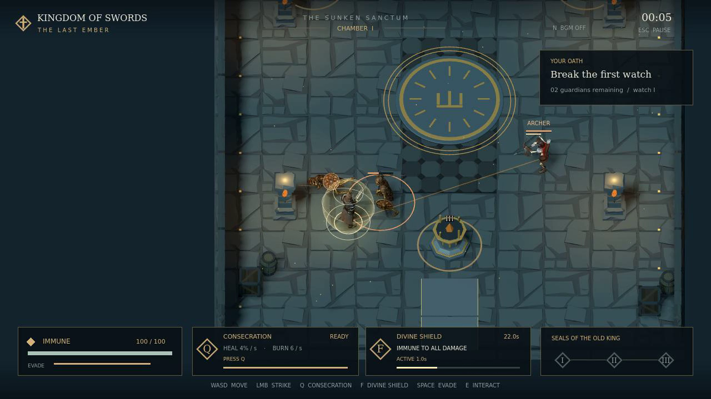

# Kingdom of Swords — The Last Ember

**使用 Agent 开发的 Godot 动作游戏，作为 Astra 开发案例分享。**

[](docs/media/gameplay.mp4)

[English](README.md) · [开发过程](docs/AGENT_WORKFLOW.md) ·
[构建与测试](docs/BUILDING.md) · [资源与许可](docs/ASSETS.md)

[▶ 观看十八秒游戏演示](docs/media/gameplay.mp4)

扮演守护最后余烬的骑士，击败三轮骷髅守卫，点燃三个封印，从北门离开。
游戏包含近战、弓箭手、闪避、奉献、圣盾术，以及完整的暂停、重开和通关流程。

这是 StevenSu 维护的独立开发展示。仓库保留了玩法实现、Blender 建模脚本、
音效合成、测试和录像驱动，便于阅读与复现关键开发步骤。
角色、场景素材与 Agent 新增实现的来源分别列明，不将已有素材归为从零创作。

## 启动

使用 **Godot 4.6.3 / GDScript / Compatibility**。

**这是带有外部美术依赖的源码版本。** 骑士、巨剑、近战骷髅和原生地牢资源，
因尚未取得原始文件可公开分发的许可说明，不进入 Git。
首次克隆会显示资源接入提示；补齐合法、兼容的资源后才能游玩原版关卡。
项目不会自动下载外部素材。

```sh
git clone https://github.com/stevensu1977/kingdom-of-swords.git
cd kingdom-of-swords
python3 tools/check_assets.py
# 按 docs/ASSETS.md 补齐外部资源。
godot --headless --path . --import
godot --path .
```

阅读代码、重建原创道具和音效、检查公开文件清单不需要这些外部美术；
完整玩法测试与录像需要它们。

## 操作

| 按键 | 功能 |
|---|---|
| WASD / 鼠标 | 移动 / 瞄准 |
| 按住鼠标左键 | 挥剑 |
| 空格 | 方向闪避 |
| Q | 奉献：持续六秒的治疗与灼烧区域 |
| F | 圣盾术：三秒免疫 |
| E | 点燃已解锁封印 / 从北门离开 |
| Escape | 暂停 / 继续 |
| R | 结束后重新开始 |
| N / BGM 按钮 | 开关背景音乐，自动保存偏好 |
| M | 临时开关全部声音 |

三轮共十二名敌人，每个封印恢复 30 HP。弓箭手会预告射击方向；
走位、闪避、掩体、近战打断和圣盾术都能应对。

## 开源内容

- 主游戏及其移动、战斗、技能、UI 和特效代码。
- 祭坛、冠冕封印、飞箭的 Blender Python 构建脚本。
- 原创战斗音效、技能音效和氛围音乐的合成脚本。
- 战斗、技能、音乐控制测试与十八秒引擎录像驱动。
- 资源清单、构建说明和公开文件审计工具。

本版本聚焦 The Last Ember，未包含原项目中独立的农场、实验室、仓库和射击示例。
仓库只保留选定的 BGM 开关演示视频及从中截取的 README 封面，
未包含其他制作过程图片或旧录像。点击封面即可打开演示视频。
该视频展示公开版菜单整理前的原游戏。
当前已完成三角形祭坛布局、左下角出生点、独立 BGM 开关和本地偏好保存。
完整验证结果见 [VALIDATION.md](docs/VALIDATION.md)。

下一步是补齐外部资源的公开授权，或制作可公开分发的替代资源。
代码和原创资产采用已有的 MIT 许可证；第三方素材沿用各自条款。
资源表在英文 README 中，署名与许可见
[THIRD_PARTY_NOTICES.txt](THIRD_PARTY_NOTICES.txt)。
